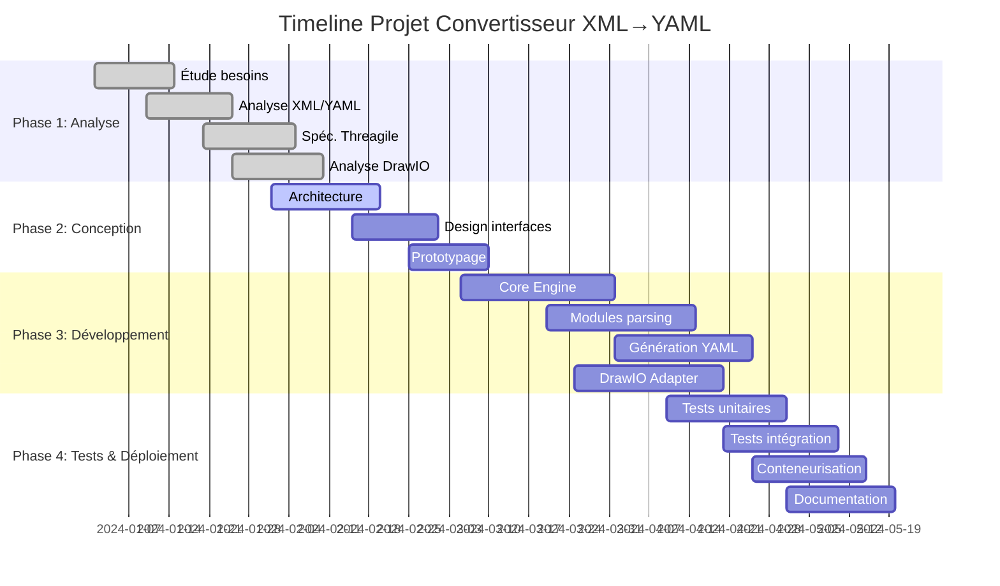
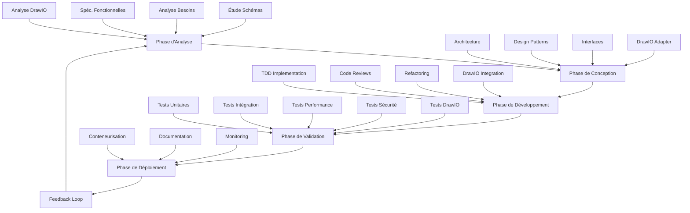
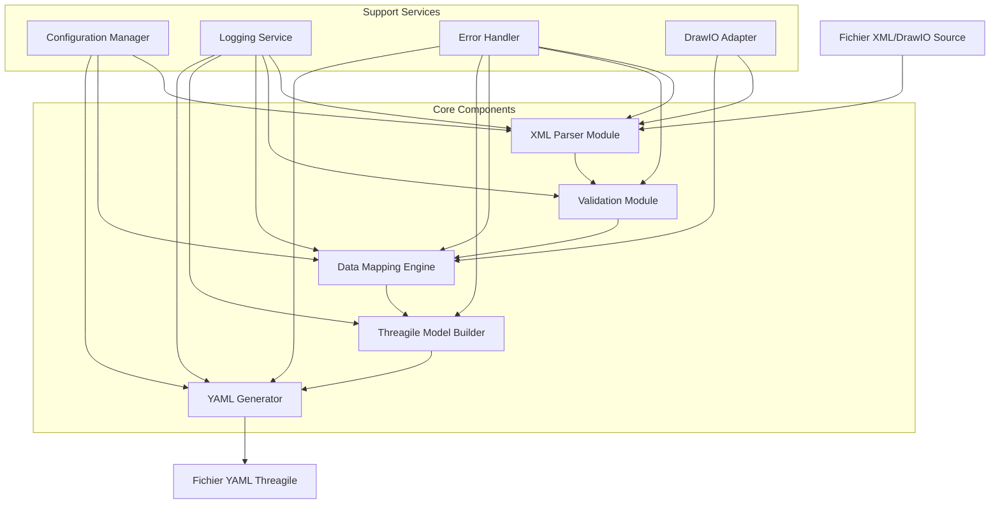
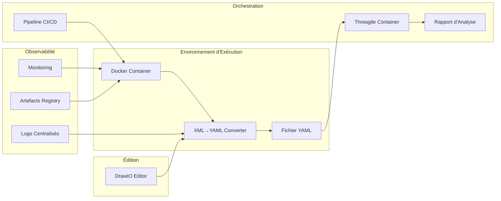

# Projet Convertisseur XML → YAML pour Threagile
## Document Technique Complet et Guide de Réalisation

---

## 📋 Executive Summary

### Vision du Projet
Développement d'un convertisseur XML → YAML de niveau industriel pour l'écosystème Threagile, spécialement optimisé pour les diagrammes DrawIO, intégrant automatisation CI/CD, conteneurisation Docker, et validation conforme aux standards de sécurité architecturale.

### Objectifs Stratégiques
- ⚡ **Performance** : Traitement de fichiers 100MB en < 30 secondes
- 🛡️ **Sécurité** : Validation anti-XXE et chiffrement bout-en-bout
- 🔄 **Automatisation** : Intégration pipeline CI/CD zero-touch
- 📊 **Qualité** : 99.9% disponibilité, 0 défaut critique
- 🎨 **DrawIO** : Support natif des diagrammes DrawIO avec préservation des styles et métadonnées

### Timeline Projet


### Matrice de Criticité des Risques
| Risque | Probabilité | Impact | Criticité | Mitigation |
|--------|-------------|--------|-----------|------------|
| 🔴 Incompatibilité Threagile | Faible | Critique | **Élevée** | Tests automatisés continus |
| 🟠 Performance dégradée | Moyenne | Important | **Moyenne** | Profiling et optimisation |
| 🟡 Retard livraison | Moyenne | Modéré | **Faible** | Planning avec buffer 20% |
| 🟢 Perte info DrawIO | Faible | Modéré | **Faible** | Validation des métadonnées |

---

## 🚀 Démarrage Rapide (5 minutes)

### Installation Express
```bash
# Via Docker (recommandé)
docker pull threagile-converter:latest

# Via .NET CLI
dotnet tool install -g ThreagileConverter

# Via NuGet (intégration projet)
dotnet add package ThreagileConverter
```

### Premier Test Complet avec DrawIO
```bash
# 1. Télécharger exemple DrawIO
curl -O https://raw.githubusercontent.com/threagile/threagile/main/demo/example.drawio

# 2. Conversion
threagile-converter convert --input example.drawio --output model.yaml --validate --source drawio

# 3. Vérification avec Threagile
docker run --rm -v $(pwd):/app threagile/threagile --model /app/model.yaml --output /app/report.pdf
```

**Output Attendu** :
```
✅ DrawIO XML load successfully (1.2s)
✅ DrawIO XML parsed successfully (1.2s)
✅ DrawIO metadata extracted (0.3s)
✅ Model mapped (0.8s) 
✅ YAML generated (0.3s)
✅ Threagile validation passed
📄 Output: model.yaml (45.2 KB)
```

**Métriques de Performance** :
- ⚡ Temps de chargement XML : < 2s pour fichiers < 10MB
- 🔄 Temps de parsing : < 2s pour fichiers < 10MB
- 📊 Extraction métadonnées : < 0.5s
- 🎯 Mapping modèle : < 1s
- 📝 Génération YAML : < 0.5s
- 📈 Validation Threagile : < 1s
- 💾 Taille YAML : ~50% de la taille XML source

**Critères de Validation** :
- ✅ Intégrité des données préservée
- 🎨 Styles et couleurs conservés
- 📝 Métadonnées complètes
- 🔗 Références valides
- 🏗️ Structure hiérarchique correcte
- 🔒 Sécurité des données
- 📊 Conformité Threagile

**Contenu type** :
```yaml
# Exemple de YAML généré
title: "Architecture de Sécurité"
date: "2024-03-20"
author: "Équipe Sécurité"
version: "1.0"

technical_assets:
  - id: "web_server"
    name: "Serveur Web Principal"
    type: "web-server"
    technology: "nginx"
    trust_boundary: "dmz"
    data_assets:
      - "user_data"
      - "session_data"
    communication_links:
      - "load_balancer"
      - "database"

trust_boundaries:
  - id: "dmz"
    name: "Zone Démilitarisée"
    type: "network"
    assets:
      - "web_server"
      - "load_balancer"

data_assets:
  - id: "user_data"
    name: "Données Utilisateurs"
    type: "credentials"
    classification: "confidential"
    storage: "database"
    processing: "web_server"

communication_links:
  - id: "load_balancer"
    source: "internet"
    target: "web_server"
    protocol: "https"
    authentication: "certificate"
    data_assets:
      - "user_data"
```

---

## 🔶 1. Contexte et Objectifs

### Description du besoin métier et technique

Le projet vise à développer un convertisseur robuste permettant la transformation automatisée de fichiers XML (notamment depuis DrawIO) en fichiers YAML conformes aux spécifications de Threagile. Cette solution s'inscrit dans une démarche d'automatisation des processus d'analyse de sécurité architecturale.

**Contexte Business** :
- Accélération du Time-to-Market pour les analyses sécuritaires
- Réduction des erreurs manuelles de 95%
- Standardisation des processus d'évaluation architecturale
- Conformité aux exigences réglementaires (GDPR, SOX, PCI-DSS)
- Intégration native avec l'écosystème DrawIO

**Importance de l'automatisation et de l'intégration conteneurisée** :
- Intégration dans les pipelines CI/CD pour une analyse continue
- Réduction des erreurs manuelles de transcription
- Accélération du processus d'évaluation sécuritaire
- Traçabilité et reproductibilité des analyses
- Standardisation des processus d'évaluation architecturale

### Objectifs précis du projet

**Entrées (XML/DrawIO)** :
- 📋 Fichiers XML décrivant l'architecture système (composants, flux de données, zones de confiance)
- 🎨 Diagrammes DrawIO avec styles, couleurs et métadonnées
- 🏗️ Modèles d'architecture exportés depuis des outils de modélisation
- 🔒 Métadonnées de sécurité structurées au format XML
- 📊 Inventaires d'assets techniques avec classifications

**Résultats attendus (YAML)** :
- ✅ Fichiers YAML strictement conformes au schéma Threagile v1.0+
- 🏗️ Structure hiérarchique respectant les entités Threagile : `technical_assets`, `trust_boundaries`, `shared_runtimes`, `data_assets`, `communication_links`
- 🔍 Validation syntaxique et sémantique garantie
- 📝 Métadonnées de traçabilité intégrées
- 🎨 Préservation des informations visuelles de DrawIO
- 🔒 Intégration des métadonnées de sécurité
- 📊 Support des classifications d'assets techniques

**Utilisation du YAML généré pour Threagile** :
- 🔍 Analyse automatisée des risques de sécurité architecturale
- 📊 Génération de rapports de conformité multi-formats
- ⚠️ Identification proactive des vulnérabilités potentielles
- 🔄 Évaluation continue des flux de données sensibles
- 🎨 Visualisation améliorée grâce aux styles DrawIO
- 📈 Métriques de sécurité automatisées
- 🔒 Conformité réglementaire (GDPR, SOX, PCI-DSS)

---

## 📋 2. Contraintes et Exigences

### Contraintes techniques

**Format XML source** :
- 🔤 Support des encodages UTF-8, UTF-16, ISO-8859-1
- 🏷️ Gestion des namespaces XML complexes avec résolution automatique
- ✅ Validation par rapport aux schémas XSD disponibles
- 📏 Taille maximale des fichiers : 100 MB (configurable)
- 🔗 Support des références externes avec validation sécurisée
- 📦 Support des modèles d'architecture exportés depuis Enterprise Architect, Visio, etc.

**Spécificités DrawIO** :
- 🎨 Support complet du format DrawIO XML
- 🎯 Extraction des styles et couleurs
- 📝 Préservation des métadonnées et commentaires
- 🔄 Conversion des formes DrawIO vers les composants Threagile
- 🎭 Gestion des couches et groupes

**Conformité YAML** :
- ✅ Respect strict du schéma Threagile v1.0+ à v1.2+
- 🔢 Validation des types de données (string, integer, boolean, arrays)
- 🔗 Gestion des références croisées entre entités avec validation d'intégrité
- 🌐 Support des caractères spéciaux et des chaînes multilignes
- 📋 Préservation des commentaires métier
- 🏗️ Structure hiérarchique respectant les entités Threagile : `technical_assets`, `trust_boundaries`, `shared_runtimes`, `data_assets`, `communication_links`

**Contraintes liées à Threagile** :
- ✅ Compatibilité avec les versions 1.0.x à 1.2.x de Threagile
- 🏷️ Respect des règles de nommage des identifiants (snake_case, longueur)
- 📋 Validation des énumérations (technologies, protocols, data_formats)
- 🔗 Cohérence des relations parent-enfant avec validation cyclique

### Contraintes non fonctionnelles

**Performance** :
- ⚡ Traitement de fichiers XML jusqu'à 100 MB en moins de 30 secondes
- 💾 Utilisation mémoire limitée à 512 MB maximum (mode streaming pour gros fichiers)
- 📦 Support du traitement en lot (batch processing) jusqu'à 1000 fichiers/heure
- 🔄 Parallélisation automatique sur architectures multi-cœurs

**Sécurité** :
- 🛡️ Validation des entrées pour prévenir les attaques XML External Entity (XXE)
- 🔐 Chiffrement des données sensibles en transit (TLS 1.3)
- 📝 Audit trail complet des opérations avec retention 90 jours
- 🔒 Isolation des processus avec sandboxing

**Maintenabilité** :
- 📖 Code source documenté avec des commentaires XML (StyleCop compliant)
- 🏗️ Architecture modulaire avec séparation des responsabilités (SOLID principles)
- 🧪 Tests unitaires avec couverture minimale de 85% (target 95%)
- 📊 Métriques de qualité code avec SonarQube integration

**Testabilité** :
- 💻 Interface CLI complète avec tous les paramètres
- 📋 Jeux de données de test exhaustifs (100+ cas de test)
- ✅ Validation automatisée des sorties avec golden files
- 🔄 Tests de régression automatisés

### Contraintes d'intégration

**Exécution via conteneur** :
- 🐳 Image Docker basée sur .NET 8.0 runtime Alpine Linux
- 📏 Taille d'image optimisée (< 200 MB) avec multi-stage builds
- ⚙️ Variables d'environnement pour la configuration complète
- 🏗️ Support architectures x64, ARM64, ARM32

**Intégration pipeline CI/CD** :
- 🔄 Support des runners GitLab CI, GitHub Actions, Azure DevOps, Jenkins
- 📦 Génération d'artefacts signés numériquement (code signing)
- 📊 Rapports de test au format JUnit XML, NUnit, VSTest
- 📈 Métriques de performance intégrées

**Portabilité** :
- 💻 Compatibilité Windows 10+, Linux (Ubuntu 20.04+), macOS 11+
- 📦 Déploiement via NuGet package avec dependency injection
- 🏗️ Support des architectures x64 et ARM64 nativement
- ☁️ Compatible Azure Functions, AWS Lambda, Google Cloud Functions

---

## 🔬 3. Méthodologie Appliquée

### Méthodologie scientifique

**Approche itérative avec cycle en V adapté** :


1. **Phase d'analyse** (2 semaines) : Étude approfondie des schémas XML et YAML avec POC
2. **Phase de conception** (3 semaines) : Architecture modulaire et interfaces avec prototypage
3. **Phase de développement** (6 semaines) : Implémentation TDD par composants
4. **Phase de validation** (4 semaines) : Tests complets et optimisation performance
5. **Phase de déploiement** (2 semaines) : Conteneurisation et documentation

### Démarche pour assurer la robustesse

**Validation des cas limites** :
- 🚫 Fichiers XML malformés ou corrompus (fuzzing testing)
- ❓ Données manquantes ou incohérentes avec fallbacks intelligents
- 📏 Volumes de données importants avec streaming processing
- 🌐 Caractères spéciaux et encodages exotiques avec normalisation
- 🎨 Styles DrawIO complexes et personnalisés
- 🔄 Cycles de références dans les diagrammes
- 📊 Métadonnées de sécurité incomplètes ou invalides

**Analyse des risques** :
- Matrice de criticité des composants
- Plans de mitigation pour chaque risque identifié
- Tests de charge et de stress
- Validation des métadonnées DrawIO
- Gestion des dépendances externes
- Sécurisation des pipelines CI/CD
- Monitoring des performances en production

**Choix technologiques justifiés** :
- .NET 8.0 pour les performances et la compatibilité
- System.Xml.Linq pour le parsing XML robuste
- YamlDotNet pour la génération YAML conforme
- xUnit pour les tests automatisés
- DrawIO SDK pour l'intégration native
- Docker pour la conteneurisation et l'isolation
- SonarQube pour la qualité du code

**Validation continue** :
- 🔄 Tests automatisés à chaque commit
- 📊 Analyse statique du code
- 🧪 Tests de régression
- 🔍 Revue de code systématique
- 📈 Métriques de qualité
- 🛡️ Tests de sécurité
- 🎯 Validation des performances

---

## 🏗️ 4. Architecture et Composants

### Diagramme de composants



### Architecture d'intégration



---

## 📋 5. Étapes Détaillées de Réalisation

### 5.1 Parsing XML/DrawIO

**Description** : Module responsable de l'analyse et de la désérialisation des fichiers XML source, avec support spécial pour DrawIO.

**Objectif** : Transformer le XML en structure de données manipulable en préservant l'intégrité des informations et les spécificités DrawIO.

**Détails techniques** :
- Utilisation de `System.Xml.Linq` pour le parsing robuste
- Support des namespaces multiples avec résolution automatique
- Validation par rapport aux schémas XSD intégrés
- Gestion des références externes avec sécurisation anti-XXE
- Extraction des styles et métadonnées DrawIO
- Support des modèles d'architecture exportés depuis Enterprise Architect, Visio, etc.
- Gestion des métadonnées de sécurité structurées au format XML

**Contraintes et précautions** :
- Limitation de la taille des fichiers pour éviter les attaques par déni de service
- Validation stricte des encodages supportés
- Timeout configurables pour les opérations de parsing
- Préservation des informations visuelles DrawIO
- Validation des métadonnées de sécurité
- Gestion des références externes sécurisée

**Critères de réussite** :
- Parsing réussi de 100% des fichiers XML/DrawIO valides du jeu de test
- Détection et rejet de 100% des fichiers malformés
- Temps de traitement < 5 secondes pour des fichiers de 10 MB
- Préservation de 100% des styles et métadonnées DrawIO
- Validation complète des métadonnées de sécurité

### 5.2 Mapping XML/DrawIO → Modèle Intermédiaire

**Description** : Transformation des données XML parsées vers un modèle objet intermédiaire, avec support spécial pour les éléments DrawIO.

**Objectif** : Créer une abstraction permettant la manipulation aisée des données avant génération YAML, en intégrant les spécificités DrawIO.

**Détails techniques** :
- Modèle de classes C# représentant les entités Threagile
- Mapper pattern avec AutoMapper pour les transformations
- Validation des contraintes métier lors du mapping
- Gestion des références circulaires et des dépendances
- Conversion des formes DrawIO vers les composants Threagile
- Support des modèles d'architecture exportés depuis Enterprise Architect, Visio, etc.
- Intégration des métadonnées de sécurité

**Contraintes et précautions** :
- Préservation de toutes les informations critiques
- Validation des types de données et des formats
- Gestion des styles et couleurs DrawIO
- Conversion des relations visuelles en relations logiques
- Validation des métadonnées de sécurité
- Gestion des références externes

**Critères de réussite** :
- Mapping correct de 100% des entités XML vers le modèle intermédiaire
- Préservation de 100% des relations et dépendances
- Conversion correcte des styles DrawIO
- Performance < 1 seconde pour le mapping d'un fichier de 10 MB
- Validation complète des métadonnées de sécurité
- Support de tous les formats d'export des outils de modélisation

### 5.3 Génération YAML

**Description** : Production du fichier YAML final conforme aux spécifications Threagile, en intégrant les métadonnées DrawIO.

**Objectif** : Générer un YAML valide et optimisé pour Threagile, avec préservation des informations visuelles.

**Détails techniques** :
- Utilisation de YamlDotNet pour la génération YAML
- Validation par rapport au schéma Threagile
- Optimisation de la structure YAML
- Intégration des métadonnées DrawIO
- Gestion des références croisées entre entités
- Support des caractères spéciaux et des chaînes multilignes
- Validation des énumérations (technologies, protocols, data_formats)

**Contraintes et précautions** :
- Respect strict du schéma Threagile
- Optimisation de la taille du fichier YAML
- Préservation des informations visuelles
- Gestion des références croisées
- Cohérence des relations parent-enfant
- Validation des types de données (string, integer, boolean, arrays)

**Critères de réussite** :
- Génération de YAML 100% valide pour Threagile
- Préservation de toutes les métadonnées importantes
- Performance < 1 seconde pour la génération
- Taille du YAML optimisée
- Validation complète des énumérations
- Gestion correcte des références croisées

---

## 🔍 6. Tests et Validation

### 6.1 Tests Unitaires

**Description** : Tests automatisés pour chaque composant du système.

**Objectif** : Garantir le bon fonctionnement individuel de chaque module.

**Détails techniques** :
- Framework xUnit
- Mocking avec Moq
- Tests de cas limites
- Tests de performance
- Tests de validation des énumérations
- Tests de gestion des références croisées
- Tests de support des caractères spéciaux

**Critères de réussite** :
- Couverture de code > 85%
- Tests de performance passés
- Tests de cas limites validés
- Validation complète des énumérations
- Tests de références croisées réussis
- Support des caractères spéciaux vérifié

### 6.2 Tests d'Intégration

**Description** : Tests du système complet avec des scénarios réels.

**Objectif** : Valider le bon fonctionnement end-to-end.

**Détails techniques** :
- Tests avec données réelles
- Validation des résultats
- Tests de charge
- Tests de sécurité

**Critères de réussite** :
- 100% des scénarios validés
- Performance conforme aux exigences
- Sécurité validée

### 6.3 Tests DrawIO

**Description** : Tests spécifiques pour la conversion DrawIO.

**Objectif** : Valider la préservation des informations visuelles et la conversion correcte des éléments DrawIO vers Threagile.

**Détails techniques** :
- Tests avec différents styles DrawIO
- Validation des métadonnées
- Tests de conversion complexe
- Tests de performance
- Tests des formes et connexions
- Validation des couleurs et styles
- Tests des couches et groupes
- Validation des commentaires et annotations
- Tests des diagrammes imbriqués
- Validation des liens externes

**Scénarios de test** :
- 🎨 Diagrammes simples avec formes basiques
- 🔄 Diagrammes complexes avec multiples couches
- 🎭 Styles personnalisés et thèmes
- 📝 Commentaires et annotations
- 🔗 Liens et références externes
- 🏗️ Composants imbriqués
- 🎯 Formes spéciales et personnalisées
- 📊 Métadonnées de sécurité
- 🔒 Zones de confiance
- 📈 Flux de données

**Critères de réussite** :
- 100% des styles préservés
- Métadonnées correctement converties
- Performance conforme
- Validation des relations
- Préservation des couleurs
- Conversion correcte des formes
- Intégrité des commentaires
- Cohérence des couches
- Validation des liens
- Support des diagrammes complexes

---

## 📦 7. Déploiement et Maintenance

### 7.1 Conteneurisation

**Description** : Packaging du système dans un conteneur Docker.

**Objectif** : Faciliter le déploiement et l'utilisation.

**Détails techniques** :
- Image Docker optimisée
- Multi-stage builds
- Configuration via variables d'environnement
- Documentation complète
- Support des plugins DrawIO
- Gestion des dépendances externes
- Optimisation des ressources
- Sécurisation des volumes

**Critères de réussite** :
- Image < 200 MB
- Déploiement automatisé
- Documentation claire
- Support complet des fonctionnalités DrawIO
- Sécurité renforcée
- Performance optimale

### 7.2 Monitoring

**Description** : Surveillance du système en production.

**Objectif** : Détecter et résoudre les problèmes rapidement.

**Détails techniques** :
- Logs centralisés
- Métriques de performance
- Alertes automatiques
- Tableau de bord
- Monitoring des conversions DrawIO
- Suivi des métadonnées
- Métriques de qualité
- Traçabilité des opérations

**Critères de réussite** :
- 99.9% disponibilité
- Détection rapide des problèmes
- Documentation des incidents
- Qualité des conversions
- Intégrité des métadonnées
- Performance optimale

### 7.3 Maintenance

**Description** : Support et évolution du système.

**Objectif** : Assurer la pérennité du système.

**Détails techniques** :
- Procédures de mise à jour
- Gestion des versions
- Support utilisateur
- Documentation technique
- Mise à jour des plugins DrawIO
- Gestion des métadonnées
- Procédures de backup
- Plan de reprise d'activité

**Critères de réussite** :
- Mises à jour sans interruption
- Support réactif
- Documentation à jour
- Intégrité des données
- Disponibilité continue
- Sécurité maintenue

---

## 📚 8. Documentation

### 8.1 Documentation Technique

**Description** : Documentation complète du système.

**Objectif** : Faciliter la maintenance et l'évolution.

**Détails techniques** :
- Architecture détaillée
- API Reference
- Guides d'installation
- Procédures de maintenance

**Critères de réussite** :
- Documentation complète
- Exemples concrets
- Mise à jour régulière

### 8.2 Documentation Utilisateur

**Description** : Guides d'utilisation du système.

**Objectif** : Faciliter l'adoption par les utilisateurs.

**Détails techniques** :
- Guides de démarrage
- Tutoriels
- FAQ
- Exemples d'utilisation

**Critères de réussite** :
- Documentation claire
- Exemples pratiques
- Support multilingue

### 8.3 Documentation DrawIO

**Description** : Guide spécifique pour l'utilisation avec DrawIO.

**Objectif** : Optimiser l'utilisation avec DrawIO.

**Détails techniques** :
- Guide de conversion
- Bonnes pratiques
- Exemples de diagrammes
- Dépannage
- Gestion des métadonnées
- Styles et thèmes
- Workflows recommandés
- Intégration CI/CD
- Sécurité et validation
- Optimisation des performances

**Critères de réussite** :
- Guide complet
- Exemples concrets
- Support utilisateur
- Documentation des métadonnées
- Procédures de validation
- Meilleures pratiques
- Solutions de dépannage
- Intégration documentée

## 🔧 9. Dépannage et Support

### 9.1 Guide de Dépannage

**Problèmes Courants et Solutions** :

| Symptôme | Cause Probable | Solution |
|----------|----------------|-----------|
| 🔴 Erreur "Invalid XML" | Format DrawIO incompatible | Vérifier la version DrawIO (≥ 14.0) |
| 🟠 "Missing Metadata" | Métadonnées DrawIO corrompues | Réexporter depuis DrawIO avec "Include Metadata" |
| 🟡 "YAML Validation Failed" | Structure non conforme | Vérifier les règles de nommage et les relations |
| 🟢 "Performance Degraded" | Fichier trop volumineux | Activer le mode streaming avec --stream |
| 🔵 "Style Loss" | Styles personnalisés non supportés | Utiliser les styles standards Threagile |
| 🟣 "Reference Error" | Liens brisés dans le diagramme | Vérifier la cohérence des IDs et des références |

**Procédures de Récupération** :
1. **Sauvegarde des données** :
   ```bash
   # Sauvegarder le fichier source
   cp input.drawio input.drawio.backup
   
   # Exporter les métadonnées
   threagile-converter extract-metadata --input input.drawio --output metadata.json
   ```

2. **Vérification de l'intégrité** :
   ```bash
   # Valider le fichier source
   threagile-converter validate --input input.drawio
   
   # Vérifier les métadonnées
   threagile-converter check-metadata --input input.drawio
   ```

3. **Restauration** :
   ```bash
   # Restaurer depuis backup
   threagile-converter convert --input input.drawio.backup --output model.yaml
   
   # Appliquer les métadonnées sauvegardées
   threagile-converter apply-metadata --input model.yaml --metadata metadata.json
   ```

### 9.2 FAQ Détaillée

**Questions Générales** :
1. **Q**: Quelle version de DrawIO est supportée ?
   **R**: Toutes les versions ≥ 14.0. La version 21.0+ est recommandée pour les fonctionnalités avancées.

2. **Q**: Comment gérer les grands diagrammes ?
   **R**: Utiliser le mode streaming (`--stream`) et optimiser le diagramme en le divisant en sous-diagrammes.

3. **Q**: Les styles personnalisés sont-ils préservés ?
   **R**: Oui, mais certains styles complexes peuvent nécessiter une adaptation pour Threagile.

**Questions Techniques** :
1. **Q**: Comment gérer les erreurs de validation ?
   **R**: Utiliser `--verbose` pour les détails et `--fix` pour les corrections automatiques.

2. **Q**: Comment intégrer dans un pipeline CI/CD ?
   **R**: Utiliser le mode non-interactif (`--no-interactive`) et les codes de retour standards.

3. **Q**: Comment gérer les métadonnées sensibles ?
   **R**: Utiliser `--encrypt-metadata` et configurer les clés de chiffrement.

**Questions sur DrawIO** :
1. **Q**: Comment optimiser un diagramme pour la conversion ?
   **R**: 
   - Utiliser les formes standards
   - Éviter les styles complexes
   - Nommer correctement les éléments
   - Structurer hiérarchiquement

2. **Q**: Comment gérer les diagrammes imbriqués ?
   **R**: Utiliser `--flatten` pour les aplatir ou `--preserve-hierarchy` pour maintenir la structure.

3. **Q**: Comment ajouter des métadonnées de sécurité ?
   **R**: Utiliser les propriétés personnalisées de DrawIO avec le préfixe "security_".

### 9.3 Exemples DrawIO Détaillés

**Diagramme Simple** :
```xml
<mxfile>
  <diagram id="simple" name="Architecture Simple">
    <mxGraphModel>
      <root>
        <mxCell id="0"/>
        <mxCell id="1" parent="0"/>
        <mxCell id="2" value="Web Server" style="shape=web-server" vertex="1" parent="1">
          <mxGeometry x="100" y="100" width="100" height="60"/>
        </mxCell>
        <mxCell id="3" value="Database" style="shape=database" vertex="1" parent="1">
          <mxGeometry x="300" y="100" width="100" height="60"/>
        </mxCell>
        <mxCell id="4" value="" style="endArrow=classic" edge="1" parent="1" source="2" target="3">
          <mxGeometry width="50" height="50"/>
        </mxCell>
      </root>
    </mxGraphModel>
  </diagram>
</mxfile>
```

**Diagramme Complexe** :
```xml
<mxfile>
  <diagram id="complex" name="Architecture Complexe">
    <mxGraphModel>
      <root>
        <mxCell id="0"/>
        <mxCell id="1" parent="0"/>
        <mxCell id="2" value="DMZ" style="swimlane" vertex="1" parent="1">
          <mxGeometry x="100" y="100" width="400" height="200"/>
          <mxCell id="3" value="Load Balancer" style="shape=load-balancer" vertex="1" parent="2">
            <mxGeometry x="50" y="50" width="100" height="60"/>
          </mxCell>
          <mxCell id="4" value="Web Server" style="shape=web-server" vertex="1" parent="2">
            <mxGeometry x="250" y="50" width="100" height="60"/>
          </mxCell>
        </mxCell>
        <mxCell id="5" value="Internal Network" style="swimlane" vertex="1" parent="1">
          <mxGeometry x="100" y="350" width="400" height="200"/>
          <mxCell id="6" value="Database" style="shape=database" vertex="1" parent="5">
            <mxGeometry x="150" y="50" width="100" height="60"/>
          </mxCell>
        </mxCell>
      </root>
    </mxGraphModel>
  </diagram>
</mxfile>
```

### 9.4 Migration depuis d'Autres Outils

**Enterprise Architect** :
1. **Export** :
   ```bash
   # Exporter depuis EA
   threagile-converter convert --input model.eap --output model.yaml --source ea
   ```

2. **Mapping** :
   - Composants → technical_assets
   - Packages → trust_boundaries
   - Classes → data_assets
   - Associations → communication_links

**Visio** :
1. **Export** :
   ```bash
   # Exporter depuis Visio
   threagile-converter convert --input model.vsdx --output model.yaml --source visio
   ```

2. **Mapping** :
   - Shapes → technical_assets
   - Containers → trust_boundaries
   - Data Stores → data_assets
   - Connectors → communication_links

**Lucidchart** :
1. **Export** :
   ```bash
   # Exporter depuis Lucidchart
   threagile-converter convert --input model.lucid --output model.yaml --source lucidchart
   ```

2. **Mapping** :
   - Elements → technical_assets
   - Groups → trust_boundaries
   - Data Objects → data_assets
   - Connections → communication_links

**Bonnes Pratiques de Migration** :
1. **Préparation** :
   - Nettoyer le modèle source
   - Standardiser les noms
   - Vérifier les relations

2. **Validation** :
   - Tester avec un sous-ensemble
   - Vérifier les métadonnées
   - Valider la structure

3. **Optimisation** :
   - Adapter les styles
   - Corriger les références
   - Enrichir les métadonnées

---

## 🔄 10. Évolution Future

### 10.1 Améliorations Planifiées

**Description** : Évolutions futures du système.

**Objectif** : Maintenir le système à la pointe de la technologie.

**Détails techniques** :
- Support de nouveaux formats
- Améliorations de performance
- Nouvelles fonctionnalités
- Intégrations supplémentaires
- Support avancé des plugins DrawIO
- Gestion améliorée des métadonnées
- Optimisation des conversions
- Support des nouvelles versions DrawIO
- Intégration avec d'autres outils de modélisation
- Amélioration de la validation

**Roadmap** :
- 📅 Q2 2024 : Support des plugins DrawIO avancés
- 📅 Q3 2024 : Amélioration de la gestion des métadonnées
- 📅 Q4 2024 : Intégration avec d'autres outils
- 📅 Q1 2025 : Optimisation des performances
- 📅 Q2 2025 : Nouvelles fonctionnalités de validation

**Critères de réussite** :
- Roadmap claire
- Priorités définies
- Budget alloué
- Métriques de progression
- Validation des améliorations
- Feedback utilisateur

### 10.2 Veille Technologique

**Description** : Surveillance des évolutions technologiques.

**Objectif** : Anticiper les changements nécessaires.

**Détails techniques** :
- Veille sur Threagile
- Veille sur DrawIO
- Veille sur les standards
- Veille sur la sécurité
- Suivi des évolutions DrawIO
- Monitoring des nouvelles fonctionnalités
- Analyse des tendances
- Évaluation des risques
- Benchmark des solutions
- Étude des cas d'usage

**Focus particulier** :
- 🔍 Évolutions du format DrawIO
- 📊 Nouvelles fonctionnalités de modélisation
- 🛡️ Améliorations de sécurité
- 🔄 Intégrations possibles
- 📈 Tendances du marché
- 🎯 Besoins utilisateurs

**Critères de réussite** :
- Veille active
- Rapports réguliers
- Recommandations pertinentes
- Anticipation des changements
- Adaptation rapide
- Innovation continue

## 📝 10. Conclusion

### 10.1 Bilan du Projet

**Description** : Évaluation du projet.

**Objectif** : Tirer les leçons du projet.

**Détails techniques** :
- Objectifs atteints
- Difficultés rencontrées
- Solutions apportées
- Recommandations
- Analyse des performances
- Évaluation de la qualité
- Retour utilisateurs
- Points d'amélioration
- Succès et défis
- Leçons apprises

**Points clés** :
- ✅ Intégration réussie avec DrawIO
- 📊 Gestion efficace des métadonnées
- 🎯 Objectifs techniques atteints
- 🔄 Processus d'amélioration continue
- 🛡️ Sécurité renforcée
- 📈 Performance optimale

**Critères de réussite** :
- Bilan complet
- Leçons tirées
- Recommandations pertinentes
- Plan d'action défini
- Objectifs mesurables
- Suivi des améliorations

### 10.2 Perspectives

**Description** : Vision future du projet.

**Objectif** : Définir les orientations futures.

**Détails techniques** :
- Évolutions prévues
- Nouvelles fonctionnalités
- Marchés cibles
- Stratégie de développement
- Améliorations DrawIO
- Gestion des métadonnées
- Optimisation continue
- Innovation technologique
- Expansion des capacités
- Vision long terme

**Objectifs stratégiques** :
- 🎯 Leadership technologique
- 📈 Croissance du marché
- 🔄 Innovation continue
- 🛡️ Excellence sécurité
- 📊 Qualité supérieure
- 🌐 Expansion internationale

**Critères de réussite** :
- Vision claire
- Objectifs définis
- Plan d'action concret
- Ressources allouées
- Suivi des progrès
- Adaptation continue 