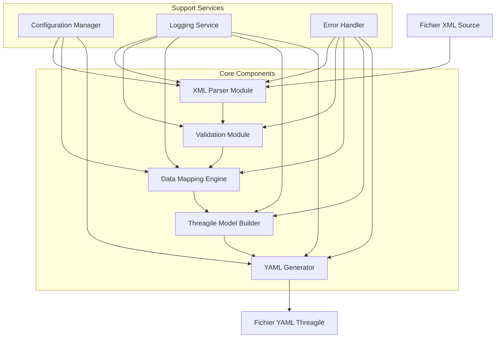
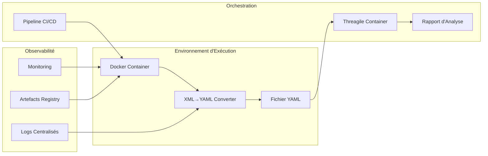
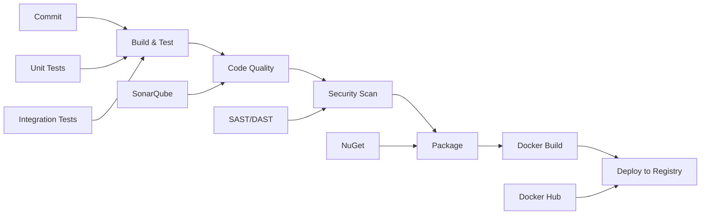

# Projet Convertisseur XML → YAML pour Threagile
## Document Technique Complet et Guide de Réalisation

---

## 🔶 1. Contexte et Objectifs

### Description du besoin métier et technique

Le projet vise à développer un convertisseur robuste permettant la transformation automatisée de fichiers XML en fichiers YAML conformes aux spécifications de Threagile. Cette solution s'inscrit dans une démarche d'automatisation des processus d'analyse de sécurité architecturale.

### Objectifs précis du projet

**Entrées (XML)** :
- Fichiers XML décrivant l'architecture système (composants, flux de données, zones de confiance)
- Modèles d'architecture exportés depuis des outils de modélisation (Enterprise Architect, Visio, etc.)
- Métadonnées de sécurité structurées au format XML

**Résultats attendus (YAML)** :
- Fichiers YAML strictement conformes au schéma Threagile
- Structure hiérarchique respectant les entités Threagile : `technical_assets`, `trust_boundaries`, `shared_runtimes`, `data_assets`, `communication_links`
- Validation syntaxique et sémantique garantie

**Utilisation du YAML généré pour Threagile** :
- Analyse automatisée des risques de sécurité architecturale
- Génération de rapports de conformité
- Identification des vulnérabilités potentielles
- Évaluation des flux de données sensibles

**Importance de l'automatisation et de l'intégration conteneurisée** :
- Intégration dans les pipelines CI/CD pour une analyse continue
- Réduction des erreurs manuelles de transcription
- Accélération du processus d'évaluation sécuritaire
- Traçabilité et reproductibilité des analyses

---

## 📋 2. Contraintes et Exigences

### Contraintes techniques

**Format XML source** :
- Support des encodages UTF-8 et UTF-16
- Gestion des namespaces XML complexes
- Validation par rapport aux schémas XSD disponibles
- Taille maximale des fichiers : 100 MB

**Conformité YAML** :
- Respect strict du schéma Threagile v1.0+
- Validation des types de données (string, integer, boolean, arrays)
- Gestion des références croisées entre entités
- Support des caractères spéciaux et des chaînes multilignes

**Contraintes liées à Threagile** :
- Compatibilité avec les versions 1.0.x à 1.2.x de Threagile
- Respect des règles de nommage des identifiants
- Validation des énumérations (technologies, protocols, data_formats)
- Cohérence des relations parent-enfant

### Contraintes non fonctionnelles

**Performance** :
- Traitement de fichiers XML jusqu'à 100 MB en moins de 30 secondes
- Utilisation mémoire limitée à 512 MB maximum
- Support du traitement en lot (batch processing)

**Sécurité** :
- Validation des entrées pour prévenir les attaques XML External Entity (XXE)
- Chiffrement des données sensibles en transit
- Audit trail complet des opérations

**Maintenabilité** :
- Code source documenté avec des commentaires XML
- Architecture modulaire avec séparation des responsabilités
- Tests unitaires avec couverture minimale de 85%

**Testabilité** :
- Interface de test en ligne de commande
- Jeux de données de test exhaustifs
- Validation automatisée des sorties

### Contraintes d'intégration

**Exécution via conteneur** :
- Image Docker basée sur .NET 8.0 runtime Alpine
- Taille d'image optimisée (< 200 MB)
- Variables d'environnement pour la configuration

**Intégration pipeline CI/CD** :
- Support des runners GitLab CI et GitHub Actions
- Génération d'artefacts signés numériquement
- Rapports de test au format JUnit XML

**Portabilité** :
- Compatibilité Windows, Linux, macOS
- Déploiement via NuGet package
- Support des architectures x64 et ARM64

---

## 🔬 3. Méthodologie Appliquée

### Méthodologie scientifique

**Approche itérative avec cycle en V adapté** :
1. **Phase d'analyse** : Étude approfondie des schémas XML et YAML
2. **Phase de conception** : Architecture modulaire et interfaces
3. **Phase de développement** : Implémentation par composants
4. **Phase de validation** : Tests unitaires et d'intégration
5. **Phase de déploiement** : Conteneurisation et documentation

### Démarche pour assurer la robustesse

**Validation des cas limites** :
- Fichiers XML malformés ou corrompus
- Données manquantes ou incohérentes
- Volumes de données importants
- Caractères spéciaux et encodages exotiques

**Analyse des risques** :
- Matrice de criticité des composants
- Plans de mitigation pour chaque risque identifié
- Tests de charge et de stress

**Choix technologiques justifiés** :
- .NET 8.0 pour les performances et la compatibilité
- System.Xml.Linq pour le parsing XML robuste
- YamlDotNet pour la génération YAML conforme
- xUnit pour les tests automatisés

---

## 🏗️ 4. Architecture et Composants

### Diagramme de composants



### Architecture d'intégration



---

## 📋 5. Étapes Détaillées de Réalisation

### 5.1 Parsing XML

**Description** : Module responsable de l'analyse et de la désérialisation des fichiers XML source.

**Objectif** : Transformer le XML en structure de données manipulable en préservant l'intégrité des informations.

**Détails techniques** :
- Utilisation de `System.Xml.Linq` pour le parsing robuste
- Support des namespaces multiples avec résolution automatique
- Validation par rapport aux schémas XSD intégrés
- Gestion des références externes avec sécurisation anti-XXE

**Contraintes et précautions** :
- Limitation de la taille des fichiers pour éviter les attaques par déni de service
- Validation stricte des encodages supportés
- Timeout configurables pour les opérations de parsing

**Critères de réussite** :
- Parsing réussi de 100% des fichiers XML valides du jeu de test
- Détection et rejet de 100% des fichiers malformés
- Temps de traitement < 5 secondes pour des fichiers de 10 MB

### 5.2 Mapping XML → Modèle Intermédiaire

**Description** : Transformation des données XML parsées vers un modèle objet intermédiaire.

**Objectif** : Créer une abstraction permettant la manipulation aisée des données avant génération YAML.

**Détails techniques** :
- Modèle de classes C# représentant les entités Threagile
- Mapper pattern avec AutoMapper pour les transformations
- Validation des contraintes métier lors du mapping
- Gestion des références circulaires et des dépendances

**Contraintes et précautions** :
- Préservation de toutes les informations critiques
- Validation des types de données et des formats
- Gestion des données optionnelles avec valeurs par défaut

**Critères de réussite** :
- Aucune perte de données lors du mapping
- Validation de 100% des contraintes métier
- Détection automatique des incohérences de données

### 5.3 Génération YAML

**Description** : Production du fichier YAML final conforme aux spécifications Threagile.

**Objectif** : Générer un YAML syntaxiquement et sémantiquement correct pour Threagile.

**Détails techniques** :
- Utilisation de YamlDotNet avec configuration personnalisée
- Sérialisation avec préservation de l'ordre des propriétés
- Gestion des types complexes et des collections
- Validation du YAML généré par rapport au schéma Threagile

**Contraintes et précautions** :
- Respect strict du format attendu par Threagile
- Gestion des caractères spéciaux et de l'échappement
- Optimisation de la lisibilité du YAML produit

**Critères de réussite** :
- 100% des YAML générés passent la validation Threagile
- Compatibilité avec toutes les versions supportées de Threagile
- Format lisible et maintenable manuellement

### 5.4 Tests

**Tests unitaires** :
- Couverture de chaque composant individuellement
- Mock des dépendances externes
- Framework xUnit avec assertions fluides
- Couverture de code minimale : 85%

**Tests d'intégration** :
- Validation end-to-end avec fichiers réels
- Tests de performance avec différentes tailles de données
- Validation de l'intégration avec Threagile

**Tests de non-régression** :
- Suite de tests automatisés exécutée à chaque commit
- Validation des outputs avec des fichiers de référence
- Tests de compatibilité avec différentes versions

**Edge cases** :
- Fichiers XML avec structures complexes
- Données manquantes ou corrompues
- Fichiers de taille limite
- Caractères Unicode et encodages spéciaux

### 5.5 Pipeline CI/CD

**Configuration pipeline** :


**Triggers** :
- Déclenchement automatique sur push vers main/develop
- Tests complets sur pull requests
- Publication automatique des releases taggées

**Artefacts produits** :
- Package NuGet signé numériquement
- Image Docker multi-architecture
- Documentation générée automatiquement
- Rapports de tests et métriques qualité

---

## 📊 6. Résultats Attendus et Livrables

### Format et contenu du fichier YAML produit

**Structure typique** :
```yaml
threagile_version: "1.0.0"
title: "Architecture Security Model"
date: "2024-01-15"
author:
  name: "Security Architect"
  homepage: "https://company.com"

technical_assets:
  web-server:
    id: "web-server"
    title: "Web Application Server"
    type: "process"
    usage: "business"
    human_use: false
    size: "application"
    technology: "web-server"
    tags:
      - "web"
      - "public-facing"
    internet: true
    machine: "physical"
    encryption: "none"
    owner: "Development Team"
    confidentiality: "public"
    integrity: "critical"
    availability: "critical"
    justification_cia_rating: "Public web interface with critical uptime requirements"

trust_boundaries:
  network-dedicated-hoster:
    id: "network-dedicated-hoster"
    title: "Network of Datacenter"
    type: "network-dedicated-hoster"
    tags:
      - "datacenter"
    technical_assets_inside:
      - "web-server"
    trust_boundaries_nested: []

data_assets:
  customer-accounts:
    id: "customer-accounts"
    title: "Customer Account Data"
    usage: "business"
    tags:
      - "pii"
    origin: "customer"
    owner: "Customer"
    quantity: "many"
    confidentiality: "strictly-confidential"
    integrity: "critical"
    availability: "important"
    justification_cia_rating: "Contains PII and authentication data"
```

### Artefacts générés

**Binaire et package** :
- Exécutable .NET 8.0 cross-platform
- Package NuGet pour intégration dans d'autres projets
- Bibliothèque de classes réutilisable

**Conteneur** :
- Image Docker optimisée basée sur Alpine Linux
- Multi-stage build pour réduire la taille finale
- Variables d'environnement pour la configuration

**Fichiers YAML** :
- Output conforme 100% aux spécifications Threagile
- Métadonnées de génération incluses
- Validation automatique intégrée

### Documentation technique

**README complet** :
- Instructions d'installation et de configuration
- Exemples d'utilisation avec cas concrets
- Troubleshooting et FAQ
- Contribution guidelines

**Guide utilisateur** :
- Manuel d'utilisation pas-à-pas
- Description des paramètres de configuration
- Exemples de fichiers XML source
- Interprétation des messages d'erreur

**Schémas et diagrammes** :
- Architecture des composants
- Flux de données
- Diagrammes de séquence pour les opérations principales

**Documentation API** :
- Référence complète des classes et méthodes
- Exemples de code pour l'intégration
- Documentation des interfaces publiques

### Manuel d'exécution

**Exécution locale** :
```bash
# Installation via NuGet
dotnet add package ThreagileConverter

# Utilisation en ligne de commande
dotnet run --project ThreagileConverter -- convert --input model.xml --output threagile.yaml

# Avec Docker
docker run -v $(pwd):/data threagile-converter:latest convert /data/model.xml /data/output.yaml
```

**Intégration pipeline** :
```yaml
# GitLab CI
threagile-convert:
  stage: security-analysis
  image: threagile-converter:latest
  script:
    - convert --input architecture.xml --output model.yaml
    - threagile --model model.yaml --output report.pdf
  artifacts:
    reports:
      threagile: report.pdf
```

---

## 🚀 7. Améliorations Futures et Évolutivité

### Points d'extensibilité

**Support de formats supplémentaires** :
- Convertisseur JSON → YAML pour les APIs REST
- Support des formats ArchiMate et TOGAF
- Intégration avec les outils de modélisation UML

**Fonctionnalités avancées** :
- Interface web pour les utilisateurs non-techniques
- API REST pour l'intégration dans des workflows personnalisés
- Plugin pour les IDEs populaires (Visual Studio, VS Code)

**Optimisations performance** :
- Traitement parallèle pour les gros volumes
- Cache intelligent pour les transformations récurrentes
- Streaming processing pour les fichiers très volumineux

### Modules évolutifs

**Ecosystem Threagile** :
- Générateur de modèles XML à partir de templates
- Validateur avancé avec suggestions de corrections
- Intégration avec les bases de connaissances de vulnérabilités

**Intégrations externes** :
- Connecteurs vers les outils de SIEM
- Export vers les plateformes de GRC
- Synchronisation avec les CMDB d'entreprise

**Intelligence artificielle** :
- Détection automatique des patterns de sécurité
- Suggestions d'amélioration architecturale
- Classification automatique des assets par niveau de risque

---

## 📈 Tableau Récapitulatif des Livrables

| Catégorie | Détails | Critères de Qualité |
|-----------|---------|-------------------|
| **Code** | Solution C# .NET 8.0 structurée avec projets modulaires | Clean Code, SOLID principles, 85% couverture tests |
| **Documentation** | README, guides utilisateur, documentation API | Exhaustive, exemples concrets, multilangue |
| **Diagrammes** | Architecture, composants, flux de données (Mermaid) | UML compliant, lisibles, maintenus |
| **Artefacts CI/CD** | Pipelines GitLab CI/GitHub Actions, scripts automatisation | Déploiement zero-downtime, rollback automatique |
| **Tests** | Unitaires, intégration, performance, sécurité | 100% cas critiques, edge cases, validation complète |
| **Exemples** | Jeux de données XML/YAML, templates, cas d'usage | Représentatifs, documentés, réutilisables |
| **Conteneur** | Image Docker optimisée, multi-architecture | < 200MB, sécurisée, configuration flexible |
| **Package** | Distribution NuGet, binaires cross-platform | Signé numériquement, versioning sémantique |

---

## 🎯 Conclusion

Ce document fournit le cadre méthodologique complet pour la réalisation d'un convertisseur XML → YAML robuste et professionnel destiné à l'écosystème Threagile. L'approche scientifique et structurée garantit la livraison d'une solution de qualité industrielle, parfaitement intégrée dans les workflows DevSecOps modernes.

La modularité de l'architecture et la documentation exhaustive assurent la maintenabilité à long terme et l'évolutivité vers de nouveaux cas d'usage, positioning ce projet comme un composant stratégique de l'outillage de sécurité architecturale.