# Documentation Technique - ThreagileConverter

## Architecture Globale

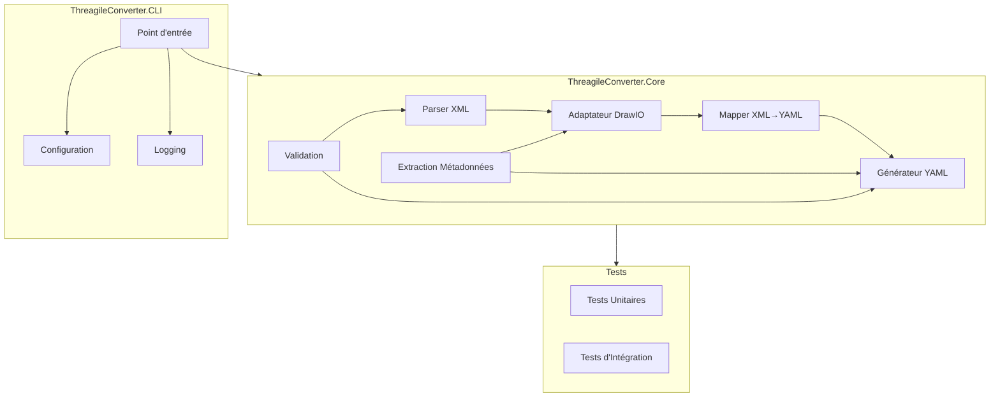

*Commentaire : Ce diagramme montre l'architecture globale du projet avec ses composants principaux et leurs interactions. Les flèches indiquent les dépendances et le flux de données.*

## Flux de Données

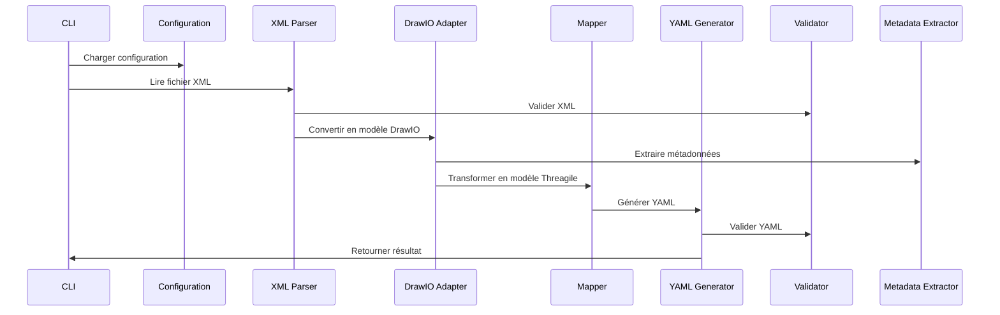

*Commentaire : Ce diagramme de séquence illustre le flux de données à travers les différents composants du système, de la lecture du fichier XML jusqu'à la génération du YAML.*

## Structure des Modules

### Module XML Parser

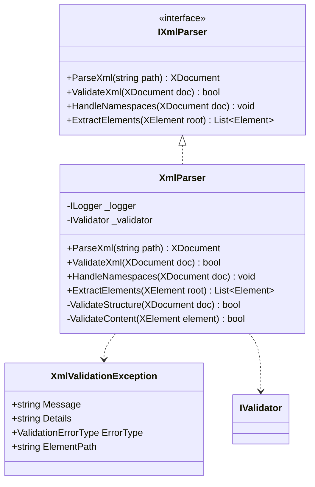

*Commentaire : Ce diagramme de classe montre la structure du module XML Parser avec son interface, son implémentation et les exceptions associées. Ajout des dépendances manquantes et des méthodes de validation.*

### Module DrawIO Adapter

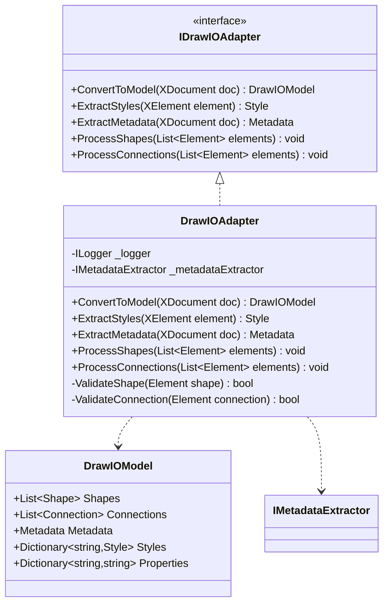

*Commentaire : Ce diagramme de classe illustre la structure du module DrawIO Adapter qui convertit le XML DrawIO en un modèle interne. Ajout des dépendances et méthodes de validation manquantes.*

### Module YAML Generator

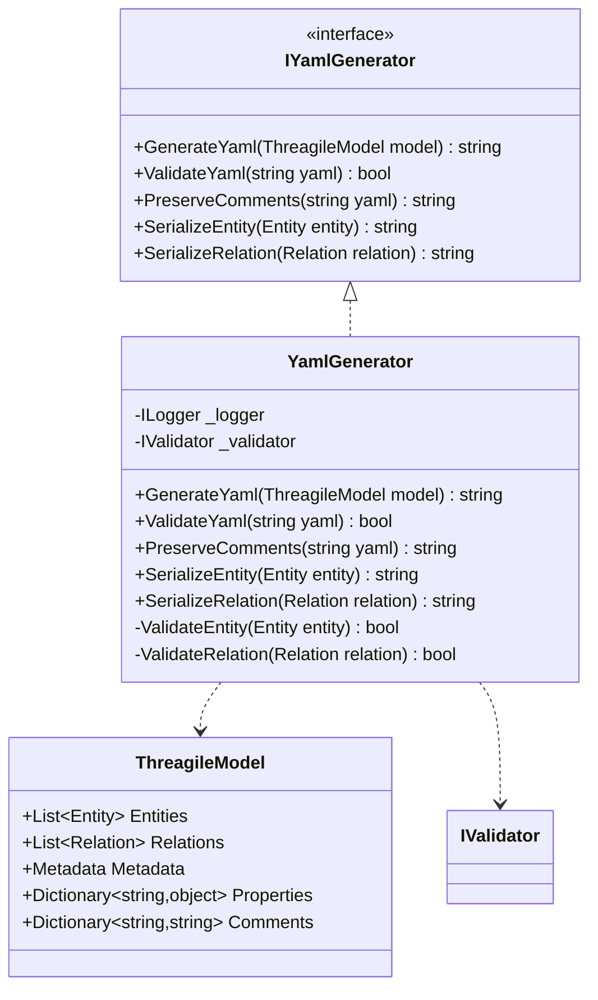

*Commentaire : Ce diagramme de classe montre la structure du module YAML Generator qui convertit le modèle Threagile en YAML. Ajout des dépendances et méthodes de validation manquantes.*

## Patterns de Conception

### Pattern Repository

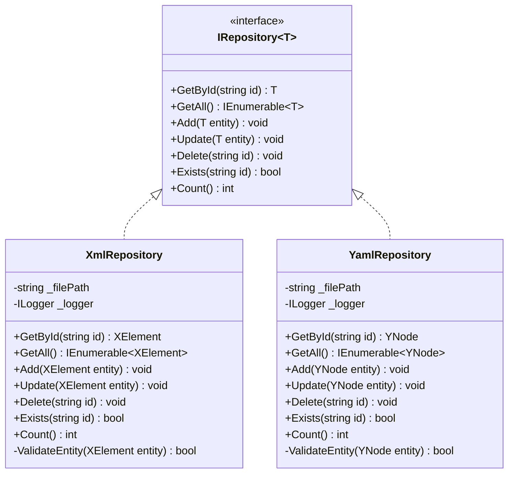

*Commentaire : Ce diagramme illustre l'utilisation du pattern Repository pour l'accès aux données XML et YAML. Ajout des méthodes manquantes et des dépendances.*

### Pattern Factory

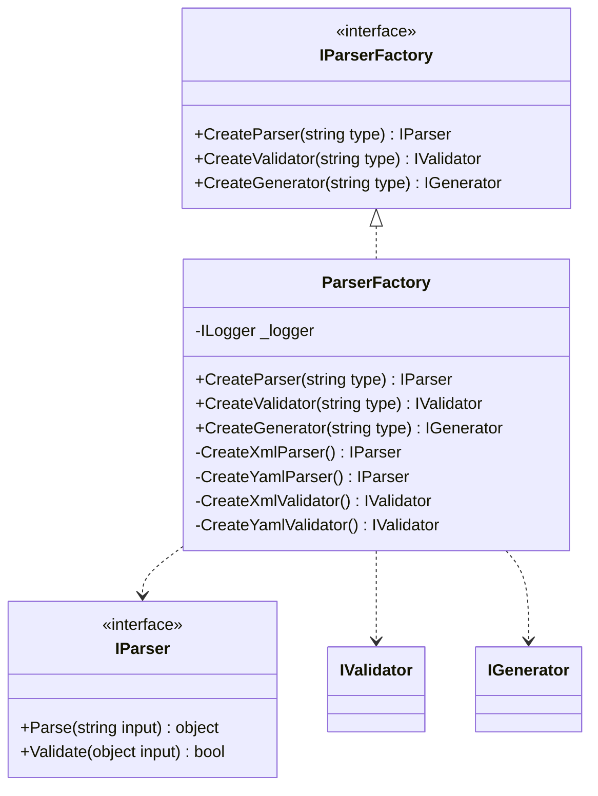

*Commentaire : Ce diagramme montre l'utilisation du pattern Factory pour la création des différents types de parsers. Ajout des méthodes manquantes et des dépendances.*

## Gestion des Erreurs

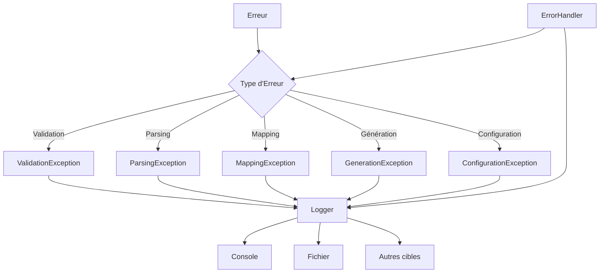

*Commentaire : Ce diagramme illustre la hiérarchie des exceptions et leur gestion dans le système. Ajout des types d'erreurs manquants et du gestionnaire d'erreurs.*

## Configuration

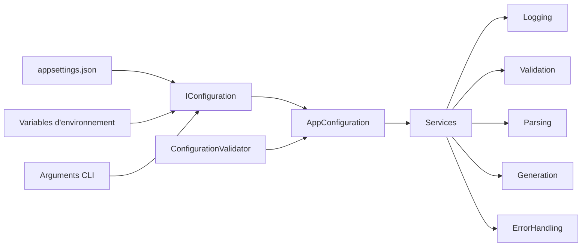

*Commentaire : Ce diagramme montre comment la configuration est chargée et distribuée aux différents services. Ajout du validateur de configuration.*

## Logging

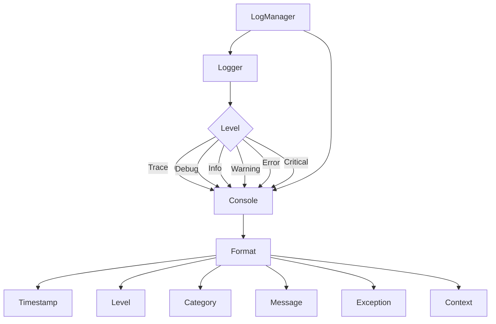

*Commentaire : Ce diagramme illustre la structure du système de logging avec ses différents niveaux et composants. Ajout des champs de log manquants et du gestionnaire de logs.*

## Validation

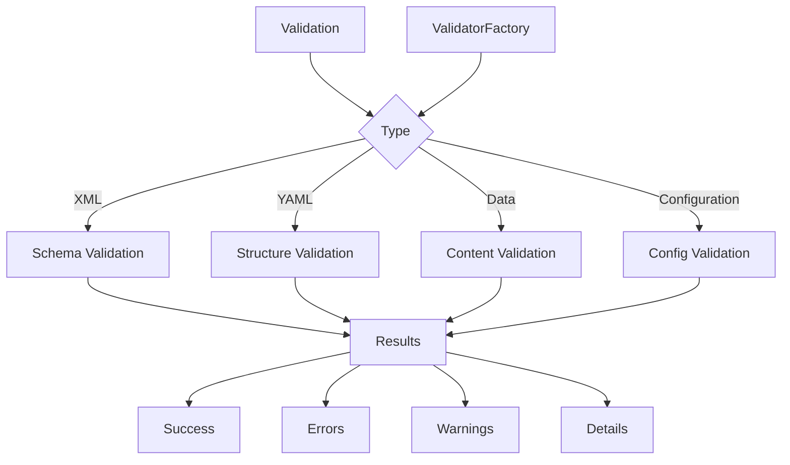

*Commentaire : Ce diagramme montre les différents types de validation et leurs résultats. Ajout des types de validation manquants et de la factory de validation.*

## Métadonnées

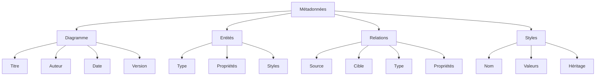

*Commentaire : Ce diagramme illustre la structure des métadonnées extraites du diagramme. Ajout des types de métadonnées manquants et de leurs propriétés.*

## Flux de Conversion

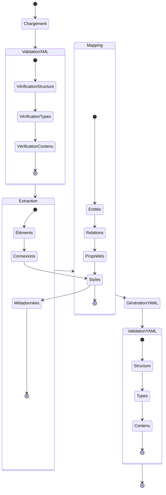

*Commentaire : Ce diagramme d'état montre le flux complet de conversion d'un diagramme DrawIO en YAML Threagile. Ajout des états manquants et des transitions.*

## Tests

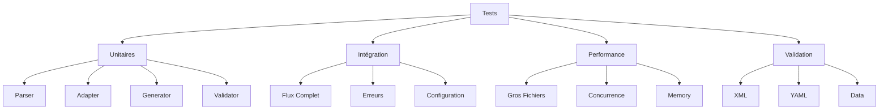

*Commentaire : Ce diagramme illustre la structure des tests avec leurs différents types et composants testés. Ajout des types de tests manquants et des composants à tester.* 