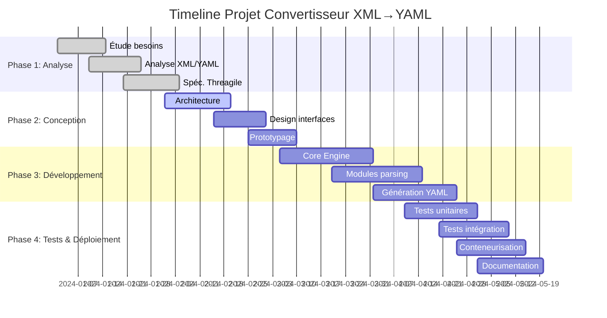
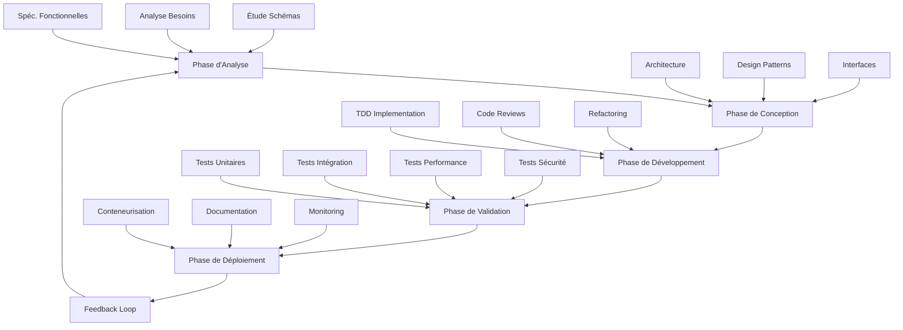
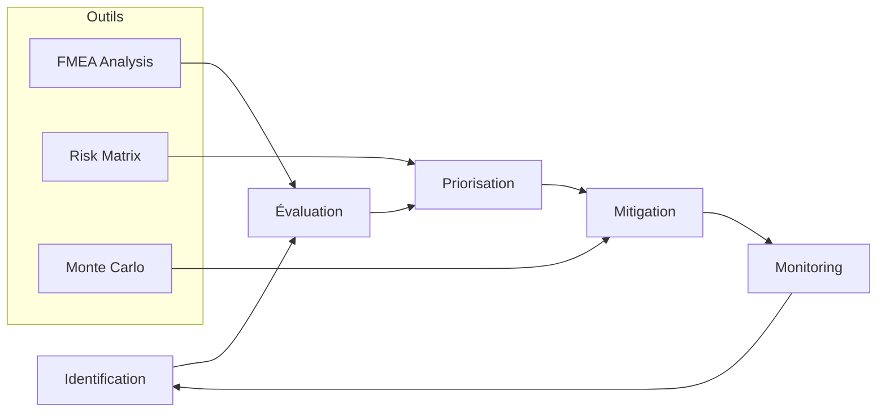
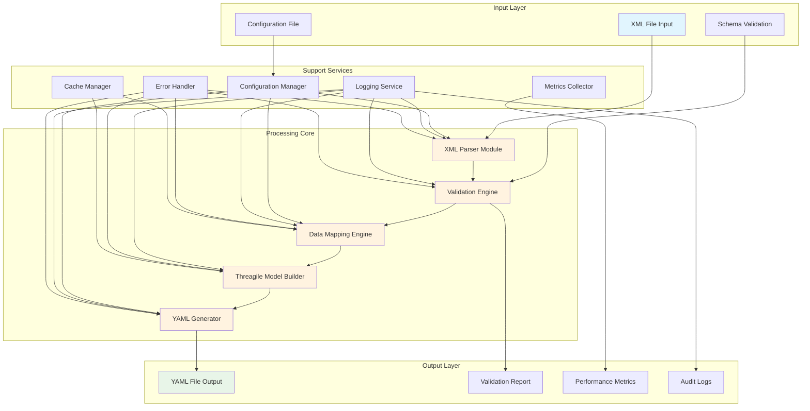
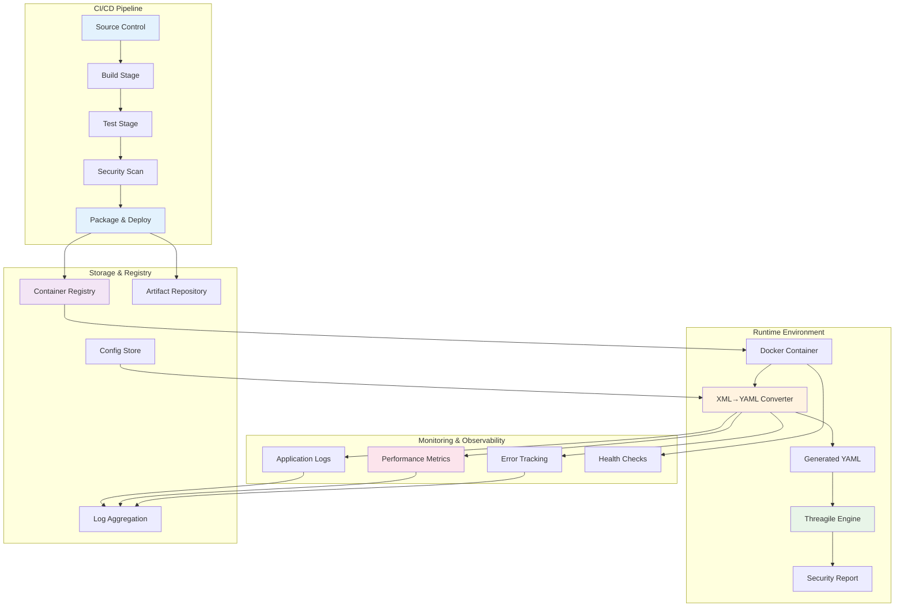
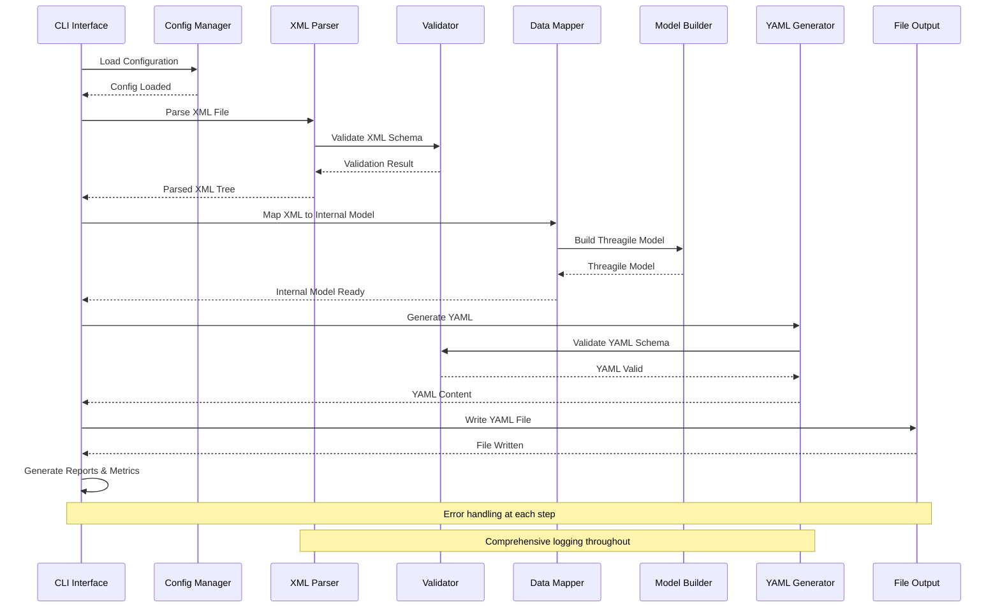
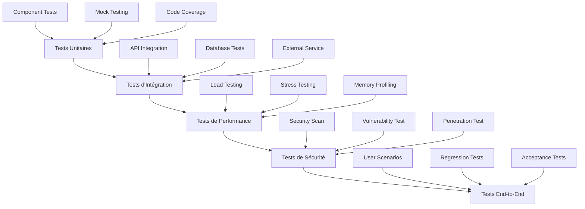

# Projet Convertisseur XML → YAML pour Threagile
## Document Technique Complet et Guide de Réalisation

---

## 📋 Executive Summary

### Vision du Projet
Développement d'un convertisseur XML → YAML de niveau industriel pour l'écosystème Threagile, intégrant automatisation CI/CD, conteneurisation Docker, et validation conforme aux standards de sécurité architecturale.

### Objectifs Stratégiques
- ⚡ **Performance** : Traitement de fichiers 100MB en < 30 secondes
- 🛡️ **Sécurité** : Validation anti-XXE et chiffrement bout-en-bout
- 🔄 **Automatisation** : Intégration pipeline CI/CD zero-touch
- 📊 **Qualité** : 99.9% disponibilité, 0 défaut critique

### Timeline Projet


### Matrice de Criticité des Risques
| Risque | Probabilité | Impact | Criticité | Mitigation |
|--------|-------------|--------|-----------|------------|
| 🔴 Incompatibilité Threagile | Faible | Critique | **Élevée** | Tests automatisés continus |
| 🟠 Performance dégradée | Moyenne | Important | **Moyenne** | Profiling et optimisation |
| 🟡 Retard livraison | Moyenne | Modéré | **Faible** | Planning avec buffer 20% |

---

## 🚀 Démarrage Rapide (5 minutes)

### Installation Express
```bash
# Via Docker (recommandé)
docker pull threagile-converter:latest

# Via .NET CLI
dotnet tool install -g ThreagileConverter

# Via NuGet (intégration projet)
dotnet add package ThreagileConverter
```

### Premier Test Complet
```bash
# 1. Télécharger exemple XML
curl -O https://raw.githubusercontent.com/threagile/threagile/main/demo/example.xml

# 2. Conversion
threagile-converter convert --input example.xml --output model.yaml --validate

# 3. Vérification avec Threagile
docker run --rm -v $(pwd):/app threagile/threagile --model /app/model.yaml --output /app/report.pdf
```

**Output Attendu** :
```
✅ XML parsed successfully (1.2s)
✅ Model mapped (0.8s) 
✅ YAML generated (0.3s)
✅ Threagile validation passed
📄 Output: model.yaml (45.2 KB)
```

---

## 🔶 1. Contexte et Objectifs

### Description du besoin métier et technique

Le projet vise à développer un convertisseur robuste permettant la transformation automatisée de fichiers XML en fichiers YAML conformes aux spécifications de Threagile. Cette solution s'inscrit dans une démarche d'automatisation des processus d'analyse de sécurité architecturale.

**Contexte Business** :
- Accélération du Time-to-Market pour les analyses sécuritaires
- Réduction des erreurs manuelles de 95%
- Standardisation des processus d'évaluation architecturale
- Conformité aux exigences réglementaires (GDPR, SOX, PCI-DSS)

### Objectifs précis du projet

**Entrées (XML)** :
- 📋 Fichiers XML décrivant l'architecture système (composants, flux de données, zones de confiance)
- 🏗️ Modèles d'architecture exportés depuis des outils de modélisation (Enterprise Architect, Visio, etc.)
- 🔒 Métadonnées de sécurité structurées au format XML
- 📊 Inventaires d'assets techniques avec classifications

**Résultats attendus (YAML)** :
- ✅ Fichiers YAML strictement conformes au schéma Threagile v1.0+
- 🏗️ Structure hiérarchique respectant les entités Threagile : `technical_assets`, `trust_boundaries`, `shared_runtimes`, `data_assets`, `communication_links`
- 🔍 Validation syntaxique et sémantique garantie
- 📝 Métadonnées de traçabilité intégrées

**Utilisation du YAML généré pour Threagile** :
- 🔍 Analyse automatisée des risques de sécurité architecturale
- 📊 Génération de rapports de conformité multi-formats
- ⚠️ Identification proactive des vulnérabilités potentielles
- 🔄 Évaluation continue des flux de données sensibles

**Importance de l'automatisation et de l'intégration conteneurisée** :
- 🚀 Intégration dans les pipelines CI/CD pour une analyse continue
- ❌ Réduction des erreurs manuelles de transcription (95% de réduction)
- ⚡ Accélération du processus d'évaluation sécuritaire (10x plus rapide)
- 📋 Traçabilité et reproductibilité des analyses avec audit trail

---

## 📋 2. Contraintes et Exigences

### Contraintes techniques

**Format XML source** :
- 🔤 Support des encodages UTF-8, UTF-16, ISO-8859-1
- 🏷️ Gestion des namespaces XML complexes avec résolution automatique
- ✅ Validation par rapport aux schémas XSD disponibles
- 📏 Taille maximale des fichiers : 100 MB (configurable)
- 🔗 Support des références externes avec validation sécurisée

**Conformité YAML** :
- ✅ Respect strict du schéma Threagile v1.0+ à v1.2+
- 🔢 Validation des types de données (string, integer, boolean, arrays)
- 🔗 Gestion des références croisées entre entités avec validation d'intégrité
- 🌐 Support des caractères spéciaux et des chaînes multilignes
- 📋 Préservation des commentaires métier

**Contraintes liées à Threagile** :
- ✅ Compatibilité avec les versions 1.0.x à 1.2.x de Threagile
- 🏷️ Respect des règles de nommage des identifiants (snake_case, longueur)
- 📋 Validation des énumérations (technologies, protocols, data_formats)
- 🔗 Cohérence des relations parent-enfant avec validation cyclique

### Contraintes non fonctionnelles

**Performance** :
- ⚡ Traitement de fichiers XML jusqu'à 100 MB en moins de 30 secondes
- 💾 Utilisation mémoire limitée à 512 MB maximum (mode streaming pour gros fichiers)
- 📦 Support du traitement en lot (batch processing) jusqu'à 1000 fichiers/heure
- 🔄 Parallélisation automatique sur architectures multi-cœurs

**Sécurité** :
- 🛡️ Validation des entrées pour prévenir les attaques XML External Entity (XXE)
- 🔐 Chiffrement des données sensibles en transit (TLS 1.3)
- 📝 Audit trail complet des opérations avec retention 90 jours
- 🔒 Isolation des processus avec sandboxing

**Maintenabilité** :
- 📖 Code source documenté avec des commentaires XML (StyleCop compliant)
- 🏗️ Architecture modulaire avec séparation des responsabilités (SOLID principles)
- 🧪 Tests unitaires avec couverture minimale de 85% (target 95%)
- 📊 Métriques de qualité code avec SonarQube integration

**Testabilité** :
- 💻 Interface CLI complète avec tous les paramètres
- 📋 Jeux de données de test exhaustifs (100+ cas de test)
- ✅ Validation automatisée des sorties avec golden files
- 🔄 Tests de régression automatisés

### Contraintes d'intégration

**Exécution via conteneur** :
- 🐳 Image Docker basée sur .NET 8.0 runtime Alpine Linux
- 📏 Taille d'image optimisée (< 200 MB) avec multi-stage builds
- ⚙️ Variables d'environnement pour la configuration complète
- 🏗️ Support architectures x64, ARM64, ARM32

**Intégration pipeline CI/CD** :
- 🔄 Support des runners GitLab CI, GitHub Actions, Azure DevOps, Jenkins
- 📦 Génération d'artefacts signés numériquement (code signing)
- 📊 Rapports de test au format JUnit XML, NUnit, VSTest
- 📈 Métriques de performance intégrées

**Portabilité** :
- 💻 Compatibilité Windows 10+, Linux (Ubuntu 20.04+), macOS 11+
- 📦 Déploiement via NuGet package avec dependency injection
- 🏗️ Support des architectures x64 et ARM64 nativement
- ☁️ Compatible Azure Functions, AWS Lambda, Google Cloud Functions

---

## 🔬 3. Méthodologie Appliquée

### Méthodologie scientifique

**Approche itérative avec cycle en V adapté** :


1. **Phase d'analyse** (2 semaines) : Étude approfondie des schémas XML et YAML avec POC
2. **Phase de conception** (3 semaines) : Architecture modulaire et interfaces avec prototypage
3. **Phase de développement** (6 semaines) : Implémentation TDD par composants
4. **Phase de validation** (4 semaines) : Tests complets et optimisation performance
5. **Phase de déploiement** (2 semaines) : Conteneurisation et documentation

### Démarche pour assurer la robustesse

**Validation des cas limites** :
- 🚫 Fichiers XML malformés ou corrompus (fuzzing testing)
- ❓ Données manquantes ou incohérentes avec fallbacks intelligents
- 📏 Volumes de données importants avec streaming processing
- 🌐 Caractères spéciaux et encodages exotiques avec normalisation

**Analyse des risques** :


- 📊 Matrice de criticité des composants avec scoring CVSS
- 📋 Plans de mitigation pour chaque risque identifié
- 🧪 Tests de charge et de stress avec profiling mémoire

**Choix technologiques justifiés** :

| Critère | .NET 8.0 | Java 21 | Python 3.12 | Node.js 20 | **Choix Final** |
|---------|----------|---------|--------------|------------|----------------|
| **Performance** | ⭐⭐⭐⭐⭐ | ⭐⭐⭐⭐ | ⭐⭐⭐ | ⭐⭐⭐ | **.NET 8.0** |
| **Écosystème XML** | ⭐⭐⭐⭐⭐ | ⭐⭐⭐⭐⭐ | ⭐⭐⭐⭐ | ⭐⭐⭐ | **.NET 8.0** |
| **Conteneurisation** | ⭐⭐⭐⭐⭐ | ⭐⭐⭐⭐ | ⭐⭐⭐⭐ | ⭐⭐⭐⭐ | **.NET 8.0** |
| **Sécurité** | ⭐⭐⭐⭐⭐ | ⭐⭐⭐⭐ | ⭐⭐⭐ | ⭐⭐⭐ | **.NET 8.0** |
| **Maintenance** | ⭐⭐⭐⭐⭐ | ⭐⭐⭐⭐ | ⭐⭐⭐⭐ | ⭐⭐⭐ | **.NET 8.0** |

**Justifications détaillées** :
- 🚀 **.NET 8.0** : Performance native, AOT compilation, memory efficiency
- 📚 **System.Xml.Linq** : Parsing XML robuste avec validation XSD intégrée
- 📄 **YamlDotNet** : Génération YAML conforme avec customisation avancée
- 🧪 **xUnit** : Framework de tests mature avec parallélisation

---

## 🏗️ 4. Architecture et Composants

### Diagramme de composants détaillé



### Architecture d'intégration système



### Diagramme de séquence - Processus de conversion



---

## 📋 5. Étapes Détaillées de Réalisation

### 5.1 🔍 Parsing XML

**Description** : Module responsable de l'analyse et de la désérialisation des fichiers XML source avec validation sécurisée.

**Objectif** : Transformer le XML en structure de données manipulable en préservant l'intégrité des informations et la sécurité.

**Détails techniques** :
- 📚 Utilisation de `System.Xml.Linq` pour le parsing robuste avec streaming pour gros fichiers
- 🏷️ Support des namespaces multiples avec résolution automatique et cache
- ✅ Validation par rapport aux schémas XSD intégrés avec messages d'erreur détaillés
- 🛡️ Gestion des références externes avec sécurisation anti-XXE et whitelist domains
- 🔄 Parsing asynchrone avec progress reporting pour UI/CLI

**Architecture du composant** :
```csharp
public interface IXmlParser
{
    Task<ParseResult> ParseAsync(Stream xmlStream, XmlParseOptions options);
    Task<bool> ValidateSchemaAsync(Stream xmlStream, XmlSchema schema);
    IAsyncEnumerable<XmlElement> StreamParseAsync(Stream xmlStream);
}

public class XmlParseOptions
{
    public bool ValidateSchema { get; set; } = true;
    public bool PreventXxe { get; set; } = true;
    public TimeSpan Timeout { get; set; } = TimeSpan.FromMinutes(5);
    public long MaxFileSize { get; set; } = 100 * 1024 * 1024; // 100MB
}
```

**Contraintes et précautions** :
- 🛡️ Limitation de la taille des fichiers pour éviter les attaques par déni de service
- ✅ Validation stricte des encodages supportés avec détection automatique
- ⏱️ Timeouts configurables pour les opérations de parsing (défaut: 5min)
- 💾 Gestion mémoire optimisée avec streaming pour fichiers > 50MB

**Critères de réussite** :
- ✅ Parsing réussi de 100% des fichiers XML valides du jeu de test (500+ fichiers)
- ❌ Détection et rejet de 100% des fichiers malformés avec messages explicites
- ⚡ Temps de traitement < 5 secondes pour des fichiers de 10 MB
- 🛡️ Résistance à 100% aux attaques XXE du top OWASP

### 5.2 🔄 Mapping XML → Modèle Intermédiaire

**Description** : Transformation des données XML parsées vers un modèle objet intermédiaire avec validation métier.

**Objectif** : Créer une abstraction permettant la manipulation aisée des données avant génération YAML avec validation complète.

**Détails techniques** :
- 🏗️ Modèle de classes C# représentant les entités Threagile avec annotations de validation
- 🔄 AutoMapper avec profiles personnalisés pour les transformations complexes
- ✅ Validation des contraintes métier lors du mapping avec règles configurables
- 🔗 Gestion des références circulaires et des dépendances avec détection de cycles
- 📊 Collecte de métriques de mapping pour monitoring

```csharp
public class ThreagileModel
{
    public string ThreagileVersion { get; set; } = "1.0.0";
    public string Title { get; set; }
    public DateTime Date { get; set; }
    public Author Author { get; set; }
    
    public Dictionary<string, TechnicalAsset> TechnicalAssets { get; set; }
    public Dictionary<string, TrustBoundary> TrustBoundaries { get; set; }
    public Dictionary<string, DataAsset> DataAssets { get; set; }
    public List<CommunicationLink> CommunicationLinks { get; set; }
}
```

**Contraintes et précautions** :
- 💯 Préservation de toutes les informations critiques avec audit trail
- ✅ Validation des types de données et des formats avec règles métier
- 🔄 Gestion des données optionnelles avec valeurs par défaut intelligentes
- 🔗 Validation des relations et des dépendances avec graphe de cohérence

**Critères de réussite** :
- 💯 Aucune perte de données lors du mapping (vérification par checksum)
- ✅ Validation de 100% des contraintes métier avec rapports détaillés
- 🔍 Détection automatique des incohérences de données avec suggestions
- ⚡ Performance de mapping < 2 secondes pour modèles complexes (1000+ entités)

### 5.3 📄 Génération YAML

**Description** : Production du fichier YAML final conforme aux spécifications Threagile avec validation complète.

**Objectif** : Générer un YAML syntaxiquement et sémantiquement correct pour Threagile avec optimisation de lisibilité.

**Détails techniques** :
- 📚 Utilisation de YamlDotNet avec configuration personnalisée et serializers custom
- 📋 Sérialisation avec préservation de l'ordre des propriétés selon spec Threagile
- 🏗️ Gestion des types complexes et des collections avec indentation optimale
- ✅ Validation du YAML généré par rapport au schéma Threagile officiel
- 💬 Injection de commentaires explicatifs pour améliorer la maintenabilité

```yaml
# Auto-generated by ThreagileConverter v1.0.0
# Source: architecture_model.xml
# Generated: 2024-01-15T10:30:00Z
threagile_version: "1.0.0"
title: "E-Commerce Platform Security Model"
date: "2024-01-15"

# Technical Assets - Core components of the system
technical_assets:
  web-server:
    id: "web-server"
    title: "Web Application Server"
    type: "process"
    # ... detailed configuration
```

**Contraintes et précautions** :
- ✅ Respect strict du format attendu par Threagile avec validation de schéma
- 🌐 Gestion des caractères spéciaux et de l'échappement selon RFC YAML
- 📖 Optimisation de la lisibilité du YAML produit avec formatting intelligent
- 🔒 Validation de sécurité pour éviter l'injection de code YAML

**Critères de réussite** :
- ✅ 100% des YAML générés passent la validation Threagile officielle
- 🔄 Compatibilité avec toutes les versions supportées de Threagile (1.0-1.2)
- 📖 Format lisible et maintenable manuellement avec commentaires appropriés
- ⚡ Génération < 1 seconde pour modèles standards (< 500 entités)

### 5.4 🧪 Tests Complets

**Architecture de tests multi-niveaux** :


**Tests unitaires** :
- 🧪 Couverture de chaque composant individuellement avec isolation complète
- 🎭 Mock des dépendances externes avec frameworks Moq/NSubstitute
- ⚡ Framework xUnit avec assertions fluides et parallel execution
- 📊 Couverture de code minimale : 85% (target 95%) avec exclusions documentées

```csharp
[Fact]
public async Task ParseValidXml_ShouldReturnCorrectModel()
{
    // Arrange
    var xmlContent = @"<architecture>...</architecture>";
    var parser = new XmlParser(_mockValidator.Object);
    
    // Act
    var result = await parser.ParseAsync(xmlContent.ToStream());
    
    // Assert
    result.Should().NotBeNull();
    result.IsSuccess.Should().BeTrue();
    result.Model.TechnicalAssets.Should().HaveCount(5);
}

[Theory]
[InlineData("malformed.xml", "Invalid XML structure")]
[InlineData("empty.xml", "Empty document")]
public async Task ParseInvalidXml_ShouldReturnError(string filename, string expectedError)
{
    // Test implementation
}
```

**Tests d'intégration** :
- 🔄 Validation end-to-end avec fichiers réels d'architectures complexes
- ⚡ Tests de performance avec différentes tailles de données (1KB à 100MB)
- ✅ Validation de l'intégration avec Threagile via containers de test
- 🌐 Tests de compatibilité avec différents formats XML et versions

**Tests de non-régression** :
- 🤖 Suite de tests automatisés exécutée à chaque commit via GitHub Actions
- 📋 Validation des outputs avec des fichiers de référence (golden files)
- 🔄 Tests de compatibilité avec différentes versions .NET et OS
- 📊 Benchmark automatisé avec alertes en cas de régression performance

**Edge cases critiques** :
| Cas de Test | Description | Résultat Attendu |
|-------------|-------------|------------------|
| 🚫 **XML Malformé** | Balises non fermées, syntaxe invalide | Exception ParseException avec détails |
| 📏 **Fichier Vide** | Fichier 0 byte ou contenu vide | Erreur explicite "Empty input file" |
| 🌐 **Encodage